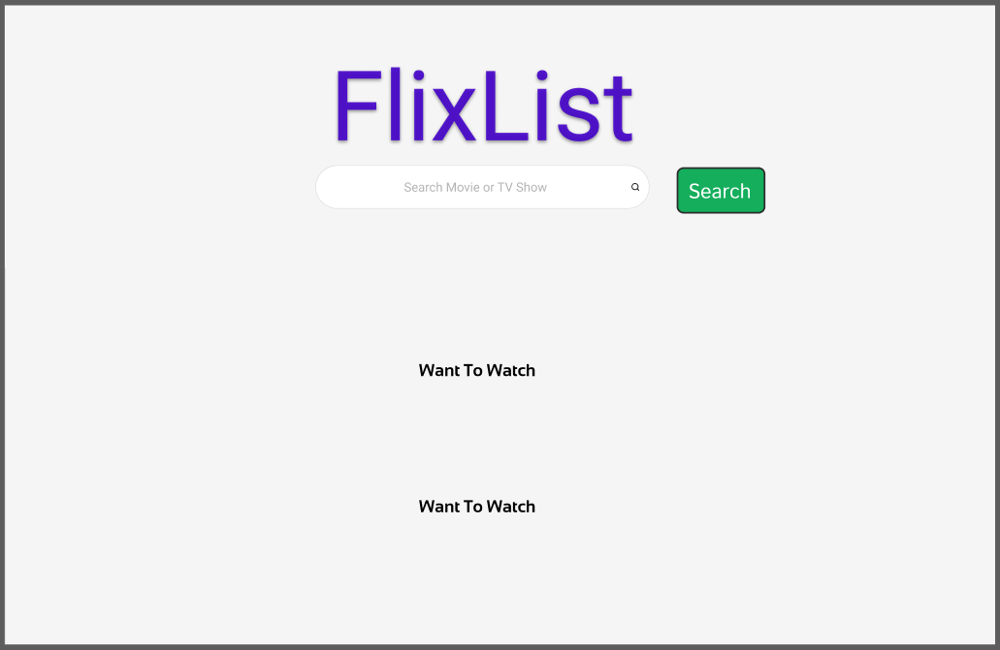
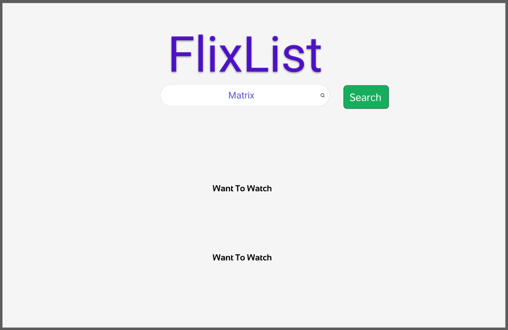
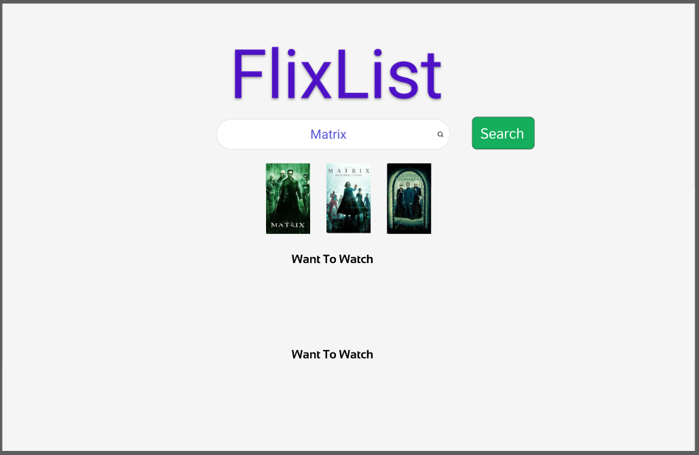
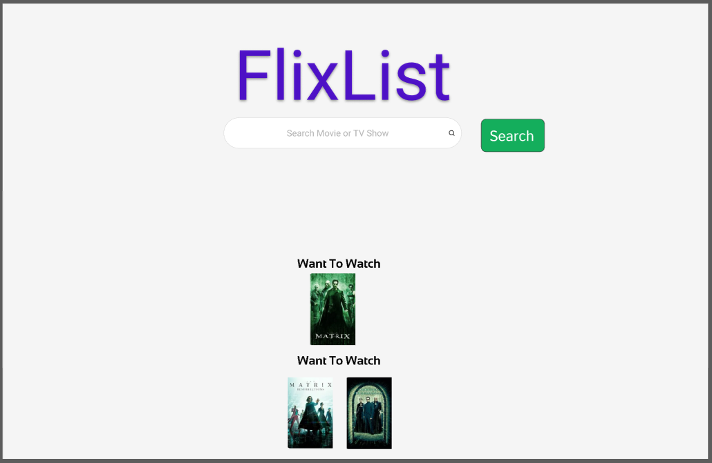

# **(FlixList) Movie Tracker - Version 5**

## 📖 Overview
Movie Tracker is a **web-based application** that allows users to **search for movies and TV shows**, save them to a **"Want to Watch"** or **"Watched"** list, and **toggle between light and dark mode**.
It utilizes the **OMDb API** to fetch movie details and **localStorage** to store watchlists.

---

## ✨ Features
- **Search for Movies & TV Shows** – Retrieves movie details using the OMDb API.
- **Watchlists** – Save movies to "Want to Watch" and "Watched" lists.
- **Remove Movies** – Delete movies from either watchlist.
- **Dark Mode Toggle** – Switch between light and dark mode.
- **Export & Import Watchlists** – Save and load watchlists as JSON files.

---

## 📁 Project Structure
```
/Movie-Tracker
│── index.html             # Main HTML file
│── README.md              # Documentation
│
├── styles/                # Stylesheets folder
│   │── style.css          # Light mode CSS styling
│   │── dark-style.css     # Dark mode CSS styling
│
├── scripts/               # JavaScript folder
│   │── script.js          # JavaScript logic for functionality
│
├── images/                # Wireframe images folder (not needed for project)
│   │── Wireframe1.png
│   │── Wireframe2.png
│   │── Wireframe3.png
│   │── Wireframe4.png
```

---

## ⚠️ **Important: API Key Usage**
This version of the project **hardcodes the API key** inside `script.js`:
```javascript
const API_KEY = "xxxxxxx";  // Replace with your actual API key
```
🔴 **Security Notice:** Hardcoding API keys **is not a best practice**, as it exposes sensitive data. Instead, consider:
✔ **Using environment variables (`.env` files)** if deploying on a backend server.
✔ **Keeping the project local** if you do not wish to expose your key.
✔ **Storing the key securely using a backend proxy or secrets management tool.**

**To use this project, replace `xxxxxx` with your own API key from** [OMDb API](https://www.omdbapi.com/).

---

## 📥 Installation & Setup

### 1️⃣ **Install Dependencies**
Ensure you have **Node.js** installed. Then, install required dependencies by running:
```sh
npm install
```

### 2️⃣ **Run the App**
Simply open the `index.html` file in your **web browser**.

---

## 🎬 **How to Use**

### 🔍 **Searching for Movies & TV Shows**
1. Enter a **movie or TV show title** in the search bar.
2. Click the **Search** button.
3. The results will display **movie posters, titles, and years**.

### 📌 **Adding Movies to a Watchlist**
1. Click the **"Want to Watch"** button to add a movie to that list.
2. Click the **"Watched"** button to mark it as watched.

### 🗑 **Removing Movies from a Watchlist**
- Click the **Remove** button next to any movie in the list.

### 🌗 **Switching Dark Mode On/Off**
- Click the **Toggle Dark Mode** button to switch between **light mode** and **dark mode**.

### 📂 **Exporting & Importing Watchlists**
- **Export**: Click the **Export** button to download your watchlist as a `.json` file.
- **Import**: Click the **Import** button and select a previously exported `.json` file to restore your watchlist.

---

## 🛠 **Technologies Used**
- **HTML, CSS, JavaScript** – Core structure, styling, and interactivity.
- **OMDb API** – Fetches movie data.
- **LocalStorage** – Stores watchlists in the browser.

---

## 🔧 **Troubleshooting**

### **The app is not fetching movie data!**
✔ Ensure your API key is correctly entered in `script.js`.
✔ Check that **your API key is valid** by testing this URL in a browser:
✔ Check the daily limit of **your API key**
```
https://www.omdbapi.com/?apikey=your_api_key_here&s=batman
```

### **Dark mode toggle isn't working!**
✔ Ensure the correct stylesheet (`style.css` or `dark-style.css`) is loading.
✔ Try **clearing your browser cache** and reloading the page.

### **Movies don't save to the watchlist!**
✔ Make sure **localStorage is enabled** in your browser settings.
✔ Try running the app in an **incognito window** to check if extensions are interfering.

---

## **Changelog (Version 5)**
- **Hardcoded API Key** – API calls are now directly handled in `script.js`.
- **Optimized Dark Mode Toggle** – Button now stays in place when clicked.
- **Fixed Search & Watchlists** – Posters now display correctly.
- **CSS Improvements** – Light and Dark mode now match in styling.

---

##  **Future Enhancements**
- Improve UI/UX with animations.
- Add user authentication to store lists online.
- Store the API key securely using a backend proxy or secrets management tool.
- Implement additional Movie or TV Show information for search results.

---
##  **Wireframe/Prototype/User Story**
- **To view the Wireframe, Prototype and User Story visit: **

[Kanban Board link](https://www.notion.so/1995b9eed32c80d58749d299b0260f20?v=1995b9eed32c8121a85d000cc94f484d&pvs=4)

-- You may find each section under completed tasks, click to view details.







## 📝 **License**
This project is open-source.